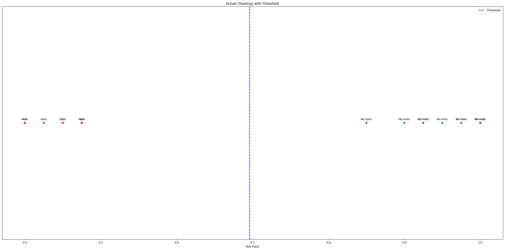
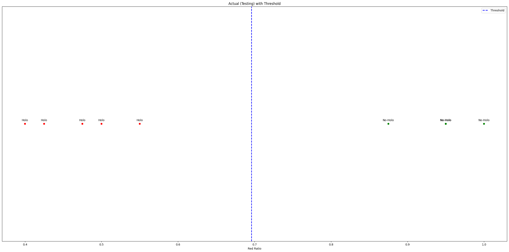
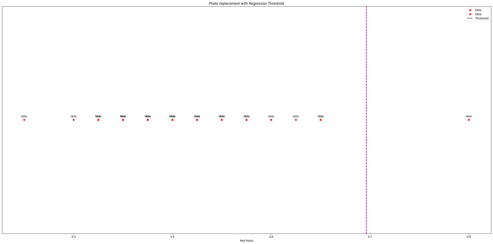
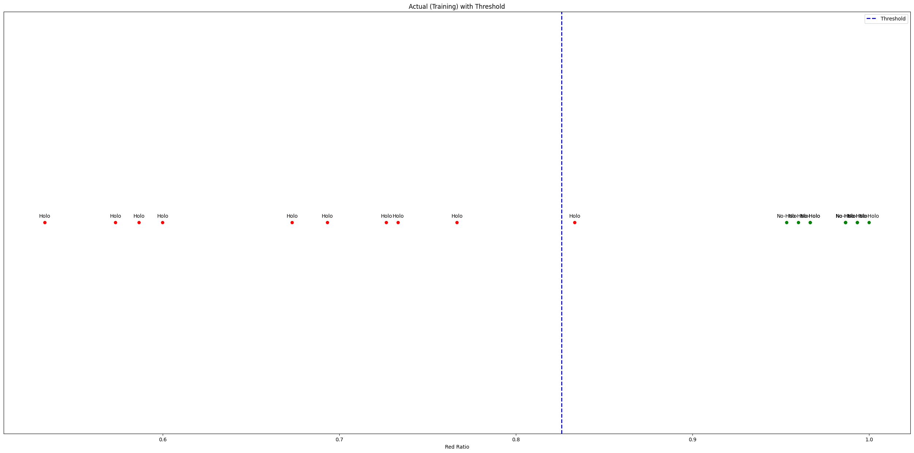
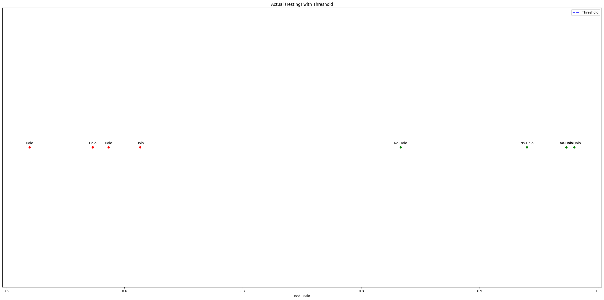

# Classification des Passeports Holographiques

## Description du Projet

Ce projet vise à classifier les passeports en deux catégories, "Holo" (avec hologramme) et "No-Holo" (sans hologramme), en utilisant des techniques de vision par ordinateur et d'apprentissage automatique. Les passeports sont d'abord divisés en patchs pour créer des mosaïques, puis ces mosaïques sont classifiées à l'aide de notre modèle en "Holo" (vert) et "No-Holo" (rouge), ce qui nous permet de générer une color-map sur le passeport initial. Enfin, nous appliquons un ratio de couleur rouge pour distinguer les passeports, permettant ainsi une classification précise.

## Figure Générale de l'Approche

## Approche Générale

1. **Division en Patchs** : Les passeports sont d'abord découpés en petits patchs afin de créer des mosaïques. Cela permet d'analyser de manière plus fine et localisée les différentes parties du passeport.
2. **Classification des Mosaïques** : Chaque patch est ensuite classifié à l'aide de notre modèle en "Holo" (vert) ou "No-Holo" (rouge).
3. **Création des Color-Maps** : Les résultats de la classification des patchs sont utilisés pour créer une color-map sur le passeport initial. Cette carte colorée permet de visualiser la distribution des zones holographiques et non holographiques.
4. **Calcul de Ratio** : Nous calculons le ratio de couleur rouge par rapport à l'ensemble de la color-map. Ce ratio nous permet de distinguer efficacement les passeports avec hologramme (faible ratio de rouge) de ceux sans hologramme (fort ratio de rouge).
5. **Détermination du Seuil** : Nous utilisons une régression pour déterminer un seuil qui sépare efficacement les données en "Holo" et "No-Holo".
6. **Classification** : Les passeports sont classifiés en utilisant le seuil déterminé sur les ensembles d'entraînement et de test.
7. **Évaluation** : Nous évaluons notre approche en testant la classification sur des ensembles de passeports, y compris des passeports avec remplacement de photo.

## Résultats de Classification des Passeports

### Patch de taille 80x71

- **Seuil déterminé par regression(Th)** : 0.696
- **Précision sur l'ensemble d'entraînement (train-d) "20 passeports"** : 100%

- **Précision sur l'ensemble de test (test-d) "10 passeports"** : 100%

- **Classification des passeports avec remplacement de photo "50 passeports"** : 98.6% classifiés correctement en Holo, 1.4% en No-Holo

### Patch de taille 40x40

- **Seuil déterminé (Th)** : 0.826
- **Précision sur l'ensemble d'entraînement (train-d) "20 passeports"** : 96.67%

- **Précision sur l'ensemble de test (test-d) "10 passeports"** : 96.67%

## Conclusion

La méthode implémentée a montré des résultats prometteurs pour la classification des passeports holographiques. Nous avons réussi à classifier avec précision les passeports en utilisant des mosaïques de différentes tailles. Les tests sur des passeports avec remplacement de photo ont également montré une robustesse de notre approche, avec seulement une erreur sur 50 passeports testés.

## Perspectives Futures

Pour améliorer notre méthode, nous envisageons de tester notre approche sur des passeports comportant des hologrammes plus complexes et d'intégrer un modèle de réseau de neurones convolutifs (CNN) pour améliorer la classification des cartes de couleurs associées aux passeports.

## Dataset

Vous pouvez trouver le jeu de données MIDV-Holo [ici](https://github.com/SmartEngines/midv-holo).

## Membres du Projet

- **ABED Nada Fatima Zohra**
- **REBAI Mohamed Younes**

---

Pour plus de détails, veuillez consulter le document complet du projet.

